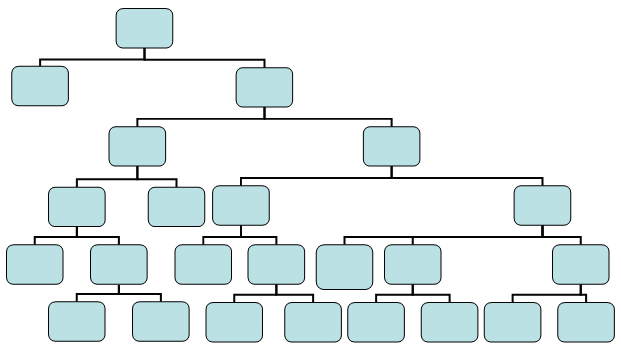
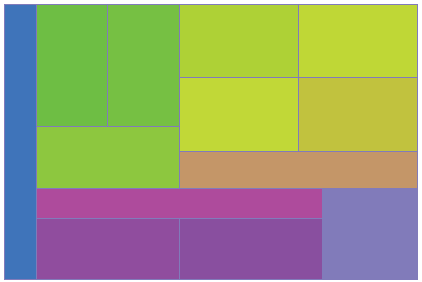
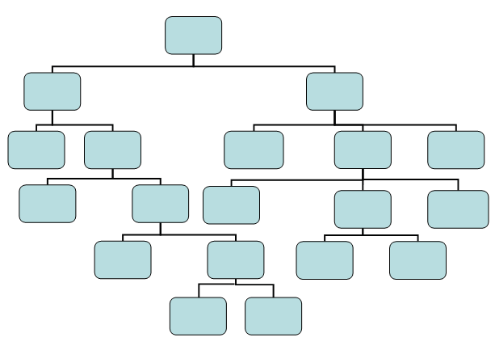
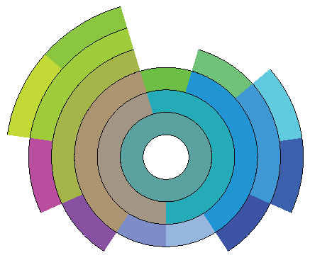
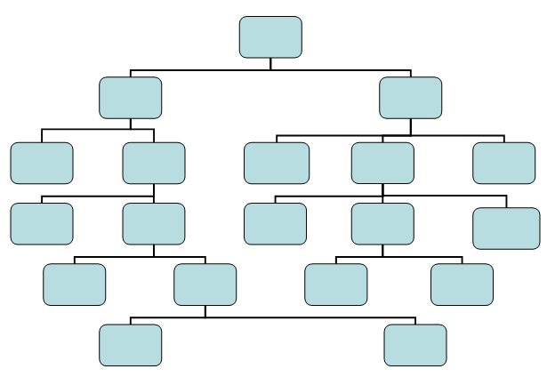
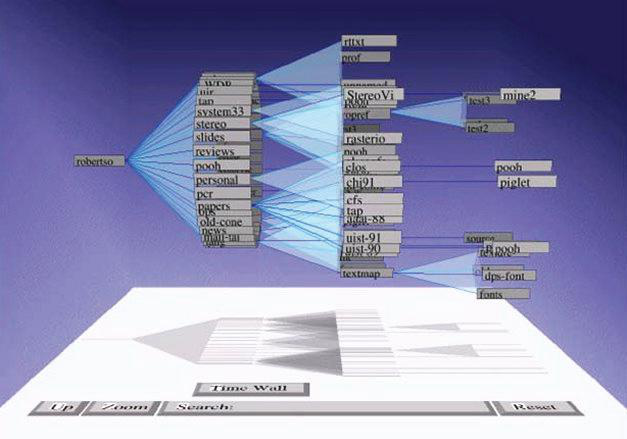

# Phần 9.1 — Hiển thị các cấu trúc phân cấp

> **Học liệu:** Matthew O. Ward, Georges Grinstein, Daniel Keim — *Interactive Data Visualization: Foundations, Techniques, and Applications*, Second Edition. CRC Press.
> **Chương 9:** Visualization Techniques for Trees, Graphs, and Networks
> **Mục dịch:** 9.1 *Displaying Hierarchical Structures* (gồm 9.1.1 và 9.1.2)
> **Phạm vi:** trang in 320–326, tương ứng trang 342–348 trong trình đọc PDF
> **Người dịch:** Nguyễn Khắc Huy (R1)

**Quy ước trình bày trong bản dịch này**

- Các khối **mã giả** (Hình 9.1 và Hình 9.3) được **giữ nguyên tiếng Anh** đúng theo bản gốc, vì đây là mã lệnh chứ không phải văn xuôi; chỉ chú thích hình được dịch.
- Số hiệu tài liệu tham khảo trong ngoặc vuông — `[206]`, `[51]`, `[393]`, `[341]` — giữ nguyên theo danh mục tham khảo của sách gốc.
- Tên các kỹ thuật đã trở thành thuật ngữ quốc tế (*treemap*, *sunburst*, *cone tree*) được giữ nguyên, có chú giải tiếng Việt ở lần xuất hiện đầu tiên. Bảng đối chiếu thuật ngữ đầy đủ đặt ở cuối tài liệu.

---

## Phần cuối lời dẫn Chương 9

> *Đoạn dưới đây nằm ở nửa trên trang 342, là phần kết của lời dẫn Chương 9 ngay trước tiêu đề mục 9.1. Dịch kèm để trang 342 được liền mạch.*

Những câu hỏi điển hình mà chúng ta đặt ra với đồ thị đều xoay quanh nút và cạnh:

- Có tồn tại đường đi từ nút *a* đến nút *b* hay không?
- Đường đi ngắn nhất từ nút *a* đến nút *b* là đường nào?
- Có bao nhiêu đường đi từ nút *a* đến nút *b*?
- Những nút nào có thể tiếp cận được từ nút *a*?
- Những nút nào nối với cả nút *a* lẫn nút *b*?
- Có bao nhiêu cạnh đi vào nút *a*?
- Hai đồ thị này có đồng nhất với nhau (đẳng cấu) hay không?
- Đồ thị con này của đồ thị *A* có nằm trong đồ thị *B* hay không?
- Trong đồ thị *A* có tồn tại chu trình hay không (một đường đi khác rỗng từ một nút quay về chính nó)?
- Có tồn tại đường đi từ nút *a* đến nút *b* mà đi qua đúng một nút khác (hoặc ít nhất một nút khác) hay không?
- Tất cả những nút mang một giá trị cụ thể hoặc nằm trong một khoảng giá trị cho trước là những nút nào?

Cần lưu ý rằng với những đồ thị không thể nạp vừa vào bộ nhớ, việc trả lời một số câu hỏi trong đó là rất khó.

Trong chương này, chúng ta sẽ khảo sát một số kỹ thuật đã được phát triển để trực quan hóa thông tin quan hệ. Tuy nhiên, những gì được trình bày ở đây mới chỉ là phần nổi của tảng băng, bởi trực quan hóa cây và đồ thị vốn là một lĩnh vực đã định hình vững chắc, với hệ thống sách chuyên khảo, tạp chí, hội nghị, gói phần mềm và thuật toán riêng của nó.

---

## 9.1 Hiển thị các cấu trúc phân cấp

Cây, hay cấu trúc phân cấp (chúng ta sẽ dùng hai thuật ngữ này thay thế cho nhau), là một trong những cấu trúc phổ biến nhất để lưu giữ thông tin quan hệ. Chính vì vậy, rất nhiều kỹ thuật trực quan hóa đã được phát triển để hiển thị loại thông tin này. Ta có thể chia các kỹ thuật đó thành hai lớp thuật toán: **lấp đầy không gian** và **không lấp đầy không gian**. Phần còn lại của mục này sẽ trình bày chi tiết cách cài đặt các thuật toán trực quan hóa loại dữ liệu này.

### 9.1.1 Các phương pháp lấp đầy không gian

Đúng như tên gọi, các kỹ thuật lấp đầy không gian tận dụng tối đa không gian hiển thị. Điều này đạt được bằng cách dùng phép đặt kề để hàm ý quan hệ, thay vì biểu đạt quan hệ bằng những cạnh nối các đối tượng dữ liệu như ở các cách tiếp cận khác. Hai hướng tiếp cận phổ biến nhất để sinh ra các cấu trúc phân cấp lấp đầy không gian là bố cục chữ nhật và bố cục xuyên tâm.

Treemap [206] cùng vô số biến thể của nó là một cách biểu diễn thay thế cho biểu đồ Venn, và là dạng phổ biến nhất của bố cục chữ nhật lấp đầy không gian. Trong treemap cơ bản, một hình chữ nhật được chia đệ quy thành các lát, luân phiên cắt theo phương ngang và phương dọc, dựa trên số lượng phần tử của các cây con ở tầng đang xét. Mã giả của quá trình này được cho ở Hình 9.1, và một ví dụ được trình bày ở Hình 9.2.

Như đã đề cập, nhiều biến thể của treemap đã được đề xuất và phát triển kể từ khi kỹ thuật này ra đời, trong đó có **treemap vuông hóa** [51] (nhằm giảm bớt sự xuất hiện của những hình chữ nhật dài và mảnh) và **treemap lồng nhau** [206] (nhằm làm nổi bật cấu trúc phân cấp).

Các phương pháp mô tả ở trên được tổ chức bằng những phép chia theo phương ngang và phương dọc để biểu đạt cấu trúc phân cấp. Tuy nhiên, còn nhiều hướng tiếp cận khác cũng khả dĩ, chẳng hạn những hướng chia không gian theo hướng xuyên tâm. Các kỹ thuật trực quan hóa phân cấp lấp đầy không gian theo hướng xuyên tâm, đôi khi được gọi là **biểu đồ sunburst** [393], đặt nút gốc của cấu trúc phân cấp ở tâm màn hình và dùng các vành tròn lồng nhau để biểu đạt các tầng của cấu trúc. Mỗi vành được chia dựa trên số nút ở tầng tương ứng. Các kỹ thuật này đi theo một chiến lược tương tự treemap, ở chỗ số nút lá trong một cây con sẽ quyết định lượng không gian màn hình được cấp phát cho cây con đó. Tuy nhiên, khác với treemap vốn dành phần lớn không gian màn hình để thể hiện các nút lá, các kỹ thuật xuyên tâm còn thể hiện cả những nút trung gian. Quá trình này được mô tả bằng mã giả ở Hình 9.3, và một ví dụ được trình bày ở Hình 9.4.

Với những kỹ thuật lấp đầy không gian này cũng như các kỹ thuật khác, màu sắc có thể được dùng để biểu đạt nhiều thuộc tính, chẳng hạn một giá trị gắn với nút (ví dụ: phân loại), hoặc để củng cố các quan hệ phân cấp — chẳng hạn các nút anh em và nút cha có thể mang màu sắc tương đồng, như thấy ở Hình 9.4. Các ký hiệu và dấu hiệu khác cũng có thể được nhúng vào các phân đoạn hình chữ nhật hoặc hình tròn để truyền đạt những đặc trưng dữ liệu khác.

#### Hình 9.1

```text
Start: Main Program
    Width = width of rectangle
    Height = height of rectangle
    Node = root node of the tree
    Origin = position of rectangle, e.g., [0,0]
    Orientation = direction of cuts, alternating between horizontal and vertical
    Treemap(Node, Orientation, Origin, Width, Height)
End: Main Program

Treemap(node n, orientation o, position orig, hsize w, vsize h)
    if n is a terminal node (i.e., it has no children)
        draw_rectangle(orig, w, h)
        return
    for each child of n (child_i), get number of terminal nodes in subtree
    sum up number of terminal nodes
    compute percentage of terminal nodes in n from each subtree (percent_i)
    if orientation is horizontal
        for each subtree
            compute offset of origin based on origin and width (offset_i)
            treemap(child_i, vertical, orig + offset_i, w * percent_i, h)
    else
        for each subtree
            compute offset of origin based on origin and height (offset_i)
            treemap(child_i, horizontal, orig + offset_i, w, h * percent_i)
End: Treemap
```

**Hình 9.1.** Mã giả vẽ một cấu trúc phân cấp bằng treemap.

#### Hình 9.2

| (a) Cấu trúc phân cấp mẫu | (b) Treemap tương ứng |
|---|---|
|  |  |

**Hình 9.2.** Một cấu trúc phân cấp mẫu và biểu đồ treemap tương ứng.

#### Hình 9.3

```text
Start: Main Program
    Start = start angle for a node (initially 0)
    End = end angle for a node (initially 360)
    Origin = position of center of sunburst, e.g., [0,0]
    Level = current level of hierarchy (initially 0)
    Width = thickness of each radial band - based on max depth and display size
    Sunburst(Node, Start, End, Level)
End: Main Program

Sunburst(node n, angle st, angle en, level l)
    if n is a terminal node (i.e., it has no children)
        draw_radial_section(Origin, st, en, l * Width, (l+1) * Width)
        return
    for each child of n (child_i), get number of terminal nodes in subtree
    sum up number of terminal nodes
    compute percentage of terminal nodes in n from each subtree (percent_i)
    for each subtree
        compute start/end angle based on size of subtrees, order, and angle range
        Sunburst(child_i, st_i, en_i, l+1)
End: Sunburst
```

**Hình 9.3.** Mã giả vẽ một cấu trúc phân cấp bằng biểu đồ sunburst.

#### Hình 9.4

| (a) Cấu trúc phân cấp mẫu | (b) Biểu đồ sunburst tương ứng |
|---|---|
|  |  |

**Hình 9.4.** Một cấu trúc phân cấp mẫu và biểu đồ sunburst tương ứng.

### 9.1.2 Các phương pháp không lấp đầy không gian

Cách biểu diễn phổ biến nhất dùng để trực quan hóa quan hệ cây hay quan hệ phân cấp là **sơ đồ nút–liên kết**. Sơ đồ tổ chức, cây gia phả và bảng ghép cặp thi đấu chỉ là một vài trong số những ứng dụng thường gặp của loại sơ đồ này. Việc vẽ những cây như vậy chịu ảnh hưởng nhiều nhất bởi hai yếu tố: **bậc phân nhánh** (ví dụ: số nút anh em mà một nút cha có thể có) và **độ sâu** (ví dụ: nút nằm xa nút gốc nhất). Những cây bị ràng buộc chặt ở một hoặc cả hai khía cạnh này — chẳng hạn cây nhị phân, hay cây chỉ có ba đến bốn tầng — thường dễ vẽ hơn nhiều so với những cây ít bị ràng buộc hơn.

Khi thiết kế thuật toán vẽ bất kỳ sơ đồ nút–liên kết nào (không riêng gì cây), ta phải cân nhắc ba nhóm nguyên tắc thường mâu thuẫn với nhau: **quy ước vẽ**, **ràng buộc** và **tính thẩm mỹ**. Các quy ước có thể bao gồm việc giới hạn cạnh chỉ được là một đoạn thẳng đơn, một chuỗi các đoạn thẳng vuông góc, các đường gấp khúc đa giác, hoặc các đường cong. Những quy ước khác có thể là đặt các nút trên một lưới cố định, hoặc buộc mọi nút anh em phải có cùng vị trí theo phương dọc. Các ràng buộc có thể bao gồm yêu cầu một nút cụ thể phải nằm ở tâm màn hình, hoặc một nhóm nút phải được đặt gần nhau, hoặc một số liên kết nhất định bắt buộc phải đi từ trên xuống dưới hoặc từ trái sang phải. Mỗi nguyên tắc nêu trên đều có thể được dùng để dẫn dắt việc thiết kế thuật toán.

Tuy nhiên, tính thẩm mỹ thường có tác động đáng kể đến khả năng diễn giải của một hình vẽ cây hay đồ thị, song lại thường dẫn đến những nguyên tắc xung đột nhau. Một số quy tắc thẩm mỹ điển hình bao gồm:

- giảm thiểu số giao cắt đường,
- duy trì một tỉ lệ khung hình dễ nhìn,
- giảm thiểu tổng diện tích của hình vẽ,
- giảm thiểu tổng độ dài các cạnh,
- giảm thiểu số điểm gấp khúc trên các cạnh,
- giảm thiểu số lượng góc hoặc độ cong khác nhau được sử dụng,
- hướng tới một cấu trúc đối xứng.

Đối với cây, đặc biệt là cây cân bằng, việc thiết kế thuật toán tuân thủ nhiều — nếu không muốn nói là hầu hết — các nguyên tắc trên là tương đối dễ dàng. Chẳng hạn, một thủ tục vẽ cây đơn giản được trình bày dưới đây (kết quả mẫu được thể hiện ở Hình 9.5):

1. Cắt vùng vẽ thành các dải có chiều cao bằng nhau, dựa trên độ sâu của cây.
2. Với mỗi tầng của cây, xác định cần vẽ bao nhiêu nút.
3. Chia mỗi dải thành các hình chữ nhật có kích thước bằng nhau, dựa trên số nút ở tầng đó.
4. Vẽ mỗi nút vào tâm hình chữ nhật tương ứng của nó.
5. Vẽ một liên kết từ điểm giữa cạnh dưới của mỗi nút đến điểm giữa cạnh trên của (các) nút con của nó.

#### Hình 9.5



**Hình 9.5.** Một ví dụ trực quan hóa cấu trúc phân cấp bằng sơ đồ nút–liên kết đơn giản, sử dụng khoảng cách đều nhau ở mỗi tầng.

Có thể thực hiện nhiều cải tiến cho thuật toán khá cơ bản này nhằm nâng cao hiệu quả sử dụng không gian và đưa các nút con lại gần nút cha hơn. Một số cải tiến đó gồm:

- Thay vì dùng khoảng cách đều và căn giữa, hãy chia mỗi tầng dựa trên số nút lá thuộc về mỗi cây con.
- Trải đều các nút lá trên toàn vùng vẽ và căn các nút cha vào chính giữa, phía trên chúng.
- Thêm một khoảng đệm giữa các nút liền kề không phải anh em để làm nổi bật quan hệ.
- Nếu có thể, sắp xếp lại thứ tự các cây con của một nút để đạt được độ đối xứng và cân đối cao hơn.
- Đặt nút gốc ở tâm màn hình và bố trí các nút con theo hướng xuyên tâm, thay vì theo phương dọc.

Đối với những cây lớn, một hướng tiếp cận phổ biến là sử dụng chiều thứ ba, bổ sung thêm các công cụ xoay, tịnh tiến và thu phóng. Có lẽ kỹ thuật nổi tiếng nhất trong số đó được gọi là **cone tree** (cây hình nón) [341]. Trong bố cục này, các nút con của một nút được sắp xếp theo hướng xuyên tâm tại những góc cách đều nhau, rồi được dịch chuyển theo phương vuông góc với mặt phẳng. Hai tham số then chốt của quá trình này là bán kính và khoảng dịch chuyển; thay đổi chúng sẽ ảnh hưởng đến mật độ của hình hiển thị và mức độ che khuất. Ở mức tối thiểu, chúng phải được đặt sao cho các nhánh riêng biệt của cây không rơi vào cùng một vùng của không gian ba chiều. Một cách để bảo đảm điều này là cho bán kính tỉ lệ nghịch với độ sâu của nút trong cây. Theo cách đó, những nút gần nút gốc sẽ được tách xa nhau đáng kể, còn những nút ở gần đáy cây thì nằm sát nhau hơn. Một ví dụ được thể hiện ở Hình 9.6.

#### Hình 9.6



**Hình 9.6.** Một ví dụ về cấu trúc phân cấp được hiển thị bằng cone tree [341]. (Hình ảnh © 1991 Association of Computing Machinery. In lại với sự cho phép, do PARC, Inc. cung cấp.)

---

## Bảng đối chiếu thuật ngữ

| Thuật ngữ gốc | Bản dịch dùng trong tài liệu |
|---|---|
| hierarchy / hierarchical structure | cấu trúc phân cấp |
| tree | cây |
| node | nút |
| edge | cạnh |
| link | liên kết |
| root node | nút gốc |
| child node | nút con |
| parent node | nút cha |
| sibling node | nút anh em |
| terminal node | nút lá |
| intermediate node | nút trung gian |
| subtree | cây con |
| depth | độ sâu |
| level | tầng |
| space-filling | lấp đầy không gian |
| non–space-filling | không lấp đầy không gian |
| display space | không gian hiển thị |
| juxtapositioning | phép đặt kề |
| treemap | treemap |
| squarified treemap | treemap vuông hóa |
| nested treemap | treemap lồng nhau |
| sunburst display | biểu đồ sunburst |
| Venn diagram | biểu đồ Venn |
| radial layout | bố cục xuyên tâm |
| node-link diagram | sơ đồ nút–liên kết |
| fan-out degree | bậc phân nhánh |
| cone tree | cone tree (cây hình nón) |
| drawing conventions | quy ước vẽ |
| constraints | ràng buộc |
| aesthetics | tính thẩm mỹ |
| line crossings | giao cắt đường |
| aspect ratio | tỉ lệ khung hình |
| bends in the edges | điểm gấp khúc trên cạnh |
| occlusion | sự che khuất |
| pseudocode | mã giả |
| binary tree | cây nhị phân |
| balanced tree | cây cân bằng |
| isomorphic | đẳng cấu |
| cycle | chu trình |
